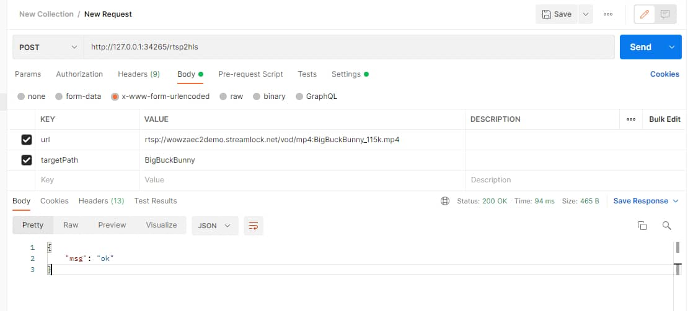
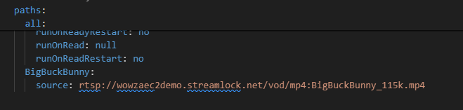

## RTSP 转协议服务 DEMO

### 基于 [MediaMTX](https://github.com/bluenviron/mediamtx) 搭配 `node express` 服务实现对 RTSP 视频流的转换示例

### 说明

`MediaMTX` 是一个强大的媒体服务器和媒体代理，允许发布、读取、代理和录制视频和音频流。

本演示示例在巨人 `MediaMTX` 的肩膀上，封装了一层 `node` 服务。可快速实现

- RTSP 转 HLS
- RTSP 转 RTMP
- ...

> 本 DEMO 最初目的是解决 RTSP 视频流无法在浏览器中直接播放的问题

### RTSP 转 HLS

#### 快速使用

```bash
# 克隆仓库
git clone https://github.com/948764321/rtsp-server-demo.git

# 进入项目目录 
cd rtsp-server-demo

# 安装依赖
npm install
```

**获取 MediaMTX**

由于 `MediaMTX` 是 `.exe` 文件，因此需要自行[下载](https://github.com/bluenviron/mediamtx/releases)，并放置于 `rtsp-server` 同级目录下，本演示仓库中用 `.temp` 替代对应位置。

**启动服务**
```bash
npm run start
```

**停止服务**
```bash
npm run stop
```

**RTSP 转 HLS**

- POST 请求进行更新 YML 配置文件


- `MediaMTX` 热更新，取到对应 hls 输出地址播放


示例：

第一步，通过请求 server 配置 YML 文件

`POST` `/rtsp2hls`

body
```json
{
  // rtsp 视频流地址
  "url": "rtsp://wowzaec2demo.streamlock.net/vod/mp4:BigBuckBunny_115k.mp4",
  // hls 输出路径
  "targetPath": "BigBuckBunny",
}
```

请求成功，`YML` 更新 `paths`


第二步，播放 `YML` 文件中 `hlsAddress` 对应的地址，可在浏览器中直接播放，即 http://127.0.0.1:5678/BigBuckBunny

### 提示

- 视频流输出端口、路径等丰富配置，请参考 [MediaMTX YML](https://github.com/bluenviron/mediamtx/blob/main/mediamtx.yml)